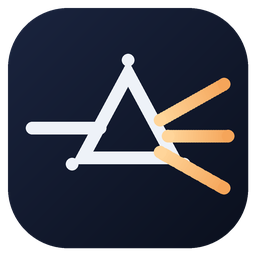

<p align="center"></p>

# LuminaTrans

Translation that sits on top of every window. Telegram, Discord, games, browsers: a small badge next to the clock, a panel that opens above it, and shortcuts that work from anywhere. Everything runs on your own computer: no subscription, no request limits, and nothing you translate leaves the machine.

## Install

1. Download the latest `LuminaTrans-Setup-x.y.z.exe` from [Releases](https://github.com/wonra16/LuminaTrans-releases/releases/latest) and run it. Windows may show a SmartScreen warning because the installer is not code-signed yet: choose More info, then Run anyway. Pick your language in the first dialog: the app opens in that language and uses it as "my language" (the other side defaults to English; English speakers get Turkish, change it in Settings).
2. On first launch a short setup runs: install **Ollama** (the local service that runs the model, official installer, one click) and download the translation model (**gemma4:e4b**, 9.6 GB, once). Speech recognition downloads its model (1.6 GB) the first time you use voice.
3. Done. The badge appears bottom right; click it to open the panel.

Requirements: Windows 10/11 64-bit, 16 GB RAM. An NVIDIA card with 6 GB+ VRAM makes everything fast (translation ~0.3 s, speech ~0.5 s); without a GPU it still works on the CPU, slower. About 15 GB of disk for the app and models.

## What it does

| Shortcut | |
|---|---|
| `Ctrl+Alt+Enter` | Translate what you typed in any input box and replace it in place, in the tone you chose. |
| `Ctrl+Alt+T` | Translate the selected text; the result lands in the Inbox tab while you stay in your app. |
| `Ctrl+Alt+V` | Speak (press, talk, press again): transcribed, translated, ready to paste. |
| `Ctrl+Alt+L` | Listen: whatever plays on your speakers (voice messages, videos, calls) becomes live subtitles at the bottom of the screen, translated. |
| `Ctrl+Alt+O` | Screen subtitles: draw a box over game dialogue or burned-in subtitles; they are read and translated as they change. |
| `Ctrl+Alt+R` | Translate a screen region once (things you cannot select). |
| `Ctrl+Alt+Space` | Show / hide the panel. |

Every translation comes in two stages: a quick plain translation first (~0.3 s), then three tones (formal, natural, emotional) with a short note on context and culture (~4 s).

Paste a screenshot into the panel (Ctrl+V) and it is read and translated like a screen region.

## Pro

The free edition keeps everything above unlimited. Pro (one-time purchase on [Gumroad](https://wonra16.gumroad.com/l/luminatrans), 7-day trial included) adds:

- **Document translation with the layout kept.** Drop a PDF, Word, PowerPoint or Excel file on the panel. PDF text is rewritten inside its original boxes with images and pages untouched; Word keeps fonts, tables, headers and footers; PowerPoint keeps every slide and note; Excel translates text cells and leaves numbers and formulas alone.
- **Choose how a document comes back** (Settings → Document translation): same layout, a readable reading copy rebuilt as headings and paragraphs with the images carried over (Word, PDF or both), or both at once; optional bilingual mode with the original under each paragraph; Fast or Careful translation (previous paragraph as context, consistent terms). Scanned PDFs, and text left inside pictures on a normal page (slides, screenshots), are read with Windows OCR. Table cells stay cells, headings keep their capitals, and names such as Quasimodo or a brand stay as written.
- **Video and audio translation.** Any media file becomes a translated `.srt`, a bilingual `.srt` (translation over original) and a side-by-side transcript. A watched folder (`Documents\LuminaTrans\Inbox`) translates anything you put in it.
- **Fix.** Write in the other language yourself; the Fix button corrects grammar, spelling and unnatural phrasing without translating, in the register you chose.
- Summaries after a listening session, read-aloud, a glossary so names and terms stay fixed, clipboard watch, and screen subtitles.

## Translation engines

Ollama runs the default model on your own PC. If you prefer a cloud provider, bring your own key: Gemini, Groq, Cerebras, OpenRouter and Mistral have free tiers; OpenAI, DeepSeek, xAI Grok and Claude are paid. Every provider has a "Fetch model list" button that shows what your key can use, the model field accepts any name, and you can add any OpenAI-compatible endpoint (Together, Fireworks, an in-house vLLM, LM Studio) under a name of your own.

## Languages

Interface in eleven languages: English, Turkish, Spanish, German, French, Portuguese, Italian, Russian, Japanese, Korean, Chinese. The language you pick in the installer becomes the app's language and your language pair. Translation into 28 languages; the 16 most used ones (Turkish, English, Spanish, German, French, Portuguese, Italian, Russian, Japanese, Korean, Chinese, Arabic, Hindi, Dutch, Polish, Ukrainian) carry native-speaker rules for formality levels, regional varieties, punctuation and gaming slang.

## Updates

Updates are a few hundred kilobytes: the app replaces only its changed files and restarts. The installer is about 170 MB; the GPU pack for speech recognition (about 900 MB) is downloaded once, only on PCs with an NVIDIA card.

## Privacy

Translation and speech recognition run locally through Ollama and Whisper. The only network use: downloading models, optional cloud providers you enable yourself (Gemini, Groq, Cerebras, Claude), and read-aloud voices. To translate a video you are watching, just press Ctrl+Alt+L while it plays.

Türkçe kılavuz: [README.tr.md](README.tr.md)

## Build from source

```
pip install -r requirements.txt
python app.py
```

`build_exe.bat` produces `dist\LuminaTrans`; `build_installer.bat` (Inno Setup 6) produces `Output\LuminaTrans-Setup-x.y.z.exe`.

## Dictionary layer and learning (0.7.0)

Local models know grammar and miss words. LuminaTrans looks a sentence's content words up in a local dictionary derived from Wiktionary and hands the meanings to the model as hints; speed is unchanged. The Turkish dictionary ships with the app; 24 other source languages download once (a few MB) when selected. The "Teach" button stores your corrected rendering: the same sentence comes back verbatim, similar ones follow your terms. Dictionary data: Wiktionary via kaikki.org, CC BY-SA 4.0.

## Context engine (0.7.1)

Screen subtitles and speaker listening carry a session context: the scene (film, game, lecture, meeting, sport, news, chat), the title of the window being read, the last few lines with their translations, and the character or player names seen so far. Film mode keeps each character's voice and slang; game mode uses player vocabulary; lecture mode keeps terms consistent. The scene is inferred from the window title by default and can be set by hand in Settings.

"My world" in Settings is a two-sentence profile (work, hobbies, jargon). Every translation lane reads it and picks terms and register to match.
